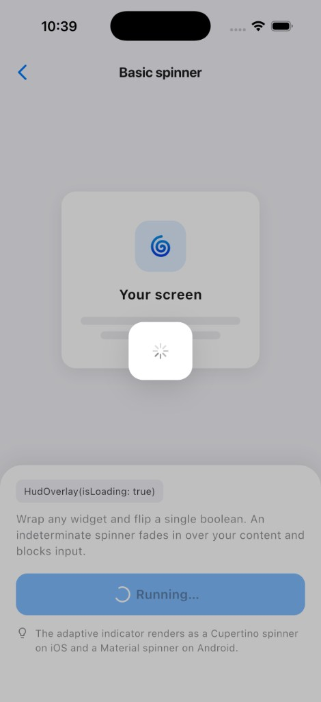
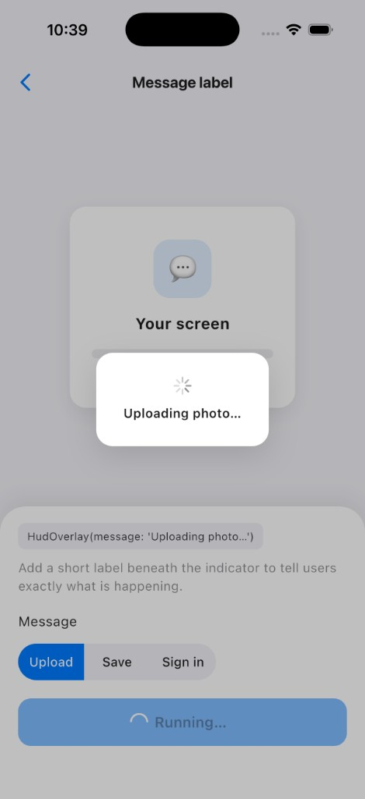
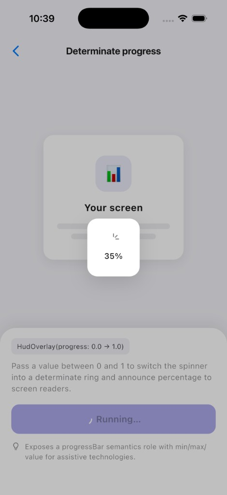
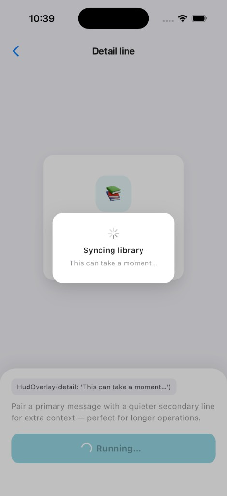
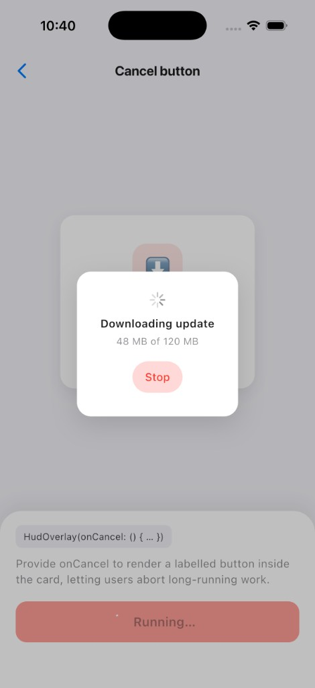

# hud_overlay

[](https://pub.dev/packages/hud_overlay)
[](LICENSE)
[](https://flutter.dev)

A simple loading spinner for your Flutter app that you can show from anywhere.

Whenever your app is busy — saving, loading, uploading — you usually want to
show a spinner and gently block the screen until it's done. `hud_overlay` makes
that a one-liner, and you don't need to pass `context` around to do it.

## Why you'll like it

- **Show it from anywhere.** Call one line from a button, a service, BLoC, or
  Riverpod — no `BuildContext` required.
- **Tell the user what's happening.** Add a message, show real progress, or
  flip to a ✓ success or ✗ error when you're done.
- **Looks good out of the box.** Sensible light and dark styles, with the
  freedom to customize everything.
- **Works for everyone.** Built-in screen-reader support so visually impaired
  users aren't left guessing.
- **No extra baggage.** Pure Dart, no other dependencies, runs on every
  platform Flutter supports.

## What it looks like

Each example below is its own screen in the [example app](example/).

<table>
  <tr>
    <td align="center" width="33%">
      <br>
      <b>Basic spinner</b><br>
      <code>HudOverlay(isLoading: true)</code>
    </td>
    <td align="center" width="33%">
      <br>
      <b>Message label</b><br>
      <code>HudOverlay(message: '…')</code>
    </td>
    <td align="center" width="33%">
      <br>
      <b>Determinate progress</b><br>
      <code>HudOverlay(progress: 0.0–1.0)</code>
    </td>
  </tr>
  <tr>
    <td align="center" width="33%">
      <br>
      <b>Detail line</b><br>
      <code>HudOverlay(detail: '…')</code>
    </td>
    <td align="center" width="33%">
      <br>
      <b>Cancel button</b><br>
      <code>HudOverlay(onCancel: …)</code>
    </td>
    <td width="33%"></td>
  </tr>
</table>

## Get started

### 1. Add it

```yaml
dependencies:
  hud_overlay: ^0.1.0
```

Then run `flutter pub get`.

### 2. Pick how you want to use it

There are two ways. Use whichever feels easier — you can mix both.

#### Option A — wrap a widget

Great when the loading belongs to one screen or form. Just wrap it and flip a
boolean:

```dart
HudOverlay(
  isLoading: _isSaving,      // true = show the spinner
  message: 'Saving…',
  child: MyForm(),
)
```

#### Option B — call it from anywhere

Great for app-wide loading from buttons, services, BLoC, or Riverpod.

First, turn it on once when your app starts:

```dart
MaterialApp(
  builder: (context, child) => HudScope(child: child!),
  home: const HomePage(),
)
```

Now show and hide it from anywhere — no `context` needed:

```dart
HudService.show(message: 'Saving…');
await saveToServer();
HudService.showSuccess(message: 'Saved!');   // shows a ✓ and disappears
```

## Handy things you can do

**Run a task and show the result automatically.** Spinner while it runs, ✓ if it
works, ✗ if it fails:

```dart
await HudService.wrap(
  api.save(),
  message: 'Saving…',
  successMessage: 'Saved!',
  errorMessage: 'Something went wrong',
);
```

**Show real progress** (like a download) from 0% to 100%:

```dart
HudService.show(progress: 0.42, message: '42%');
```

**Quick messages:**

```dart
HudService.showSuccess(message: 'Done!');
HudService.showError(message: 'No internet connection');
HudService.showInfo(message: 'Copied to clipboard');
```

**Hide it** whenever you need to:

```dart
HudService.dismiss();
```

## Make it match your app

Want a different look? Pass a `HudTheme`. Start from a ready-made light or dark
style and tweak only what you want:

```dart
HudOverlay(
  isLoading: _isLoading,
  theme: HudTheme.dark().copyWith(blur: 8), // dark style with a blurred background
  child: child,
)
```

With `HudTheme` you can change the background dimming, blur, spinner, card
shape, position (top/center/bottom), text styles, and more. You can even add a
**Cancel** button, **haptic feedback**, or let people keep tapping the screen
while it loads.

## The pieces

| Name | What it's for |
|---|---|
| `HudOverlay` | A widget that shows a loading spinner over its child. |
| `HudService` | Show/hide loading from anywhere (`show`, `showSuccess`, `showError`, `showInfo`, `dismiss`, `wrap`, …). |
| `HudScope` | Set up once so `HudService` works app-wide. |
| `HudTheme` | Controls how everything looks and behaves. |

## See it in action

The [example app](example/) has a dedicated, tap-to-try screen for every
feature — the easiest way to see what's possible.

## License

[MIT](LICENSE) — free to use in personal and commercial projects.
